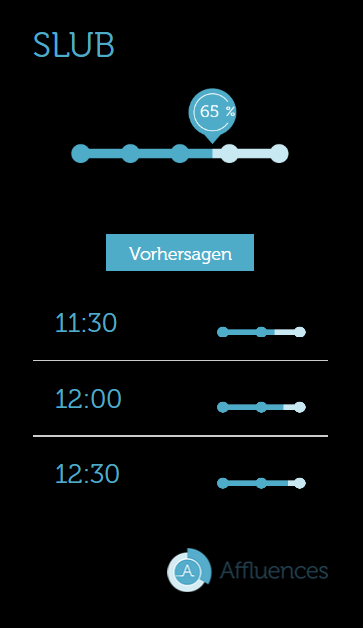

# MMM-affluences

Uses the [affluences API](https://support.affluences.com/portal/en/kb/articles/api-web-integration-and-customisation) to show the Occupancy rate of a place




## Installation

### Install

In your terminal, go to your [MagicMirror²][mm] Module folder and clone MMM-Template:

```bash
cd ~/MagicMirror/modules
git clone https://github.com/kahllenny/MMM-affluences
```

### Update

```bash
cd ~/MagicMirror/modules/MMM-affluences
git pull
```

## Using the module

To use this module, add it to the modules array in the `config/config.js` file:

```js
        {
            module: "MMM-affluences",
            position: "top_left",
            config: {
                token: "" //insert your token here
            }
        },
```

To find your token, inspect the webpage where an Affluences integration is hosted and look for the ``data-token`` attribute

A full config looks like this

```js
		{
			module: "MMM-affluences",
			position: "top_left", 
			config: {
				token: "ipPTbBm3K8JGTx",
				forecastCount: 3,
                grayscale: false,
                lang: "de",
                dataTitleOverride: true,
                dataTitleOverrideString: "SLUB"
			}
		},
```

## Configuration options

Option|Possible values|Default|Description
------|------|------|-----------
`token`|`string`|| Identifier of the affluences location
`forecastCount`|`number`|0| Shows the forecasts of the next time slots (only up to 5 possible)
`grayscale`|`boolean`|false| Enables grayscale
`lang`|`string`|en| Changes the language to de, en, es, fr, it
`dataTitleOverride`|`boolean`|false| Enables title override
`dataTitleOverrideString`|`string`|| Changes the title

[mm]: https://github.com/MagicMirrorOrg/MagicMirror
